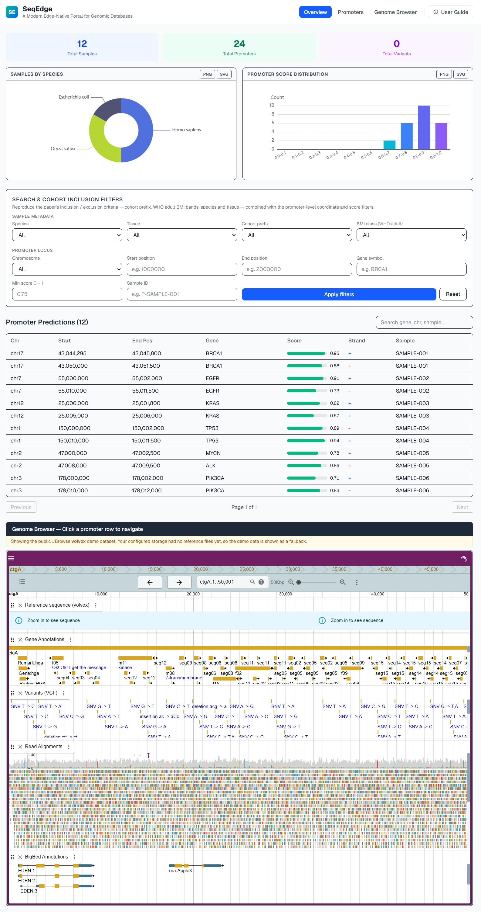
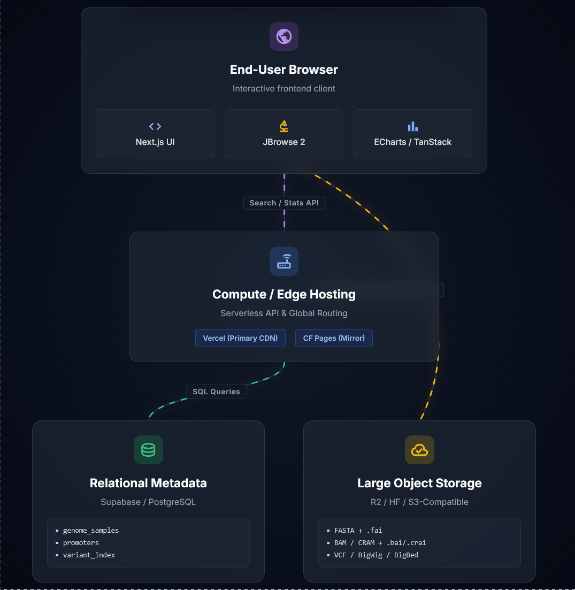

# SeqEdge



面向边缘部署的基因组数据库模板

这是一个开源模板，用于搭建支持坐标检索、图表概览、基因组浏览器和对象存储分离部署的科研数据库网站。

主站: [https://seq-edge.vercel.app](https://seq-edge.vercel.app)
镜像站: [https://seqedge.pages.dev](https://seqedge.pages.dev)
GitHub: [https://github.com/Helloxiaolaodi/SeqEdge](https://github.com/Helloxiaolaodi/SeqEdge)

语言: [English](./README.md) | 简体中文 | [问题反馈](https://github.com/Helloxiaolaodi/SeqEdge/issues)

详细搭建指南: [SeqEdge 网站搭建的详细解读](https://www.cnblogs.com/Helloxiaolaodi/p/21776373)

技术栈: Next.js | React | Supabase | Cloudflare R2 | Hugging Face Datasets | Cloudflare Workers | JBrowse 2 | TanStack Table | ECharts


## 1. 项目概览

SeqEdge 是一个可直接部署的科研数据库模板，适合需要公开展示基因组数据、预测位点、样本元数据和浏览器联动结果的研究团队。仓库将三类职责拆开处理：

- 结构化元数据存放在 Supabase / PostgreSQL；
- 大体积基因组文件存放在对象存储；
- 浏览器端通过 JBrowse 2、TanStack Table 和 ECharts 完成交互式展示。

这种拆分方式可以让关系型数据库保持轻量，也便于把 FASTA、注释文件和其他大文件放在更适合流式读取的存储层中，同时兼容 Vercel 与 Cloudflare 两类部署平台。

## 2. 架构



### 2.1 请求路径

1. 页面外壳由 Vercel 或 Cloudflare Pages 提供。
2. 检索和统计请求由 Next.js API 路由转发到 Supabase。
3. JBrowse 只按需请求当前基因组区间需要的字节范围。
4. 大体积基因组文件保留在对象存储中，而不是写入 PostgreSQL。

## 3. 快速开始

### 3.1 环境准备

- Node.js `18+`
- npm
- 一个 Supabase 项目
- 一个支持 CORS 和 HTTP Range 请求的对象存储

### 3.2 Fork 与克隆仓库

```bash
git clone https://github.com/<your-account>/SeqEdge.git
cd SeqEdge
npm install
```

### 3.3 配置环境变量

创建 `.env.local`:

```bash
NEXT_PUBLIC_SUPABASE_URL=https://your-project.supabase.co
NEXT_PUBLIC_SUPABASE_ANON_KEY=your_anon_key_here
NEXT_PUBLIC_STORAGE_BASE_URL=https://your-bucket.your-account.r2.dev/test-data
NEXT_PUBLIC_REFERENCE_ASSEMBLY=NC_045512.2
NEXT_PUBLIC_REFERENCE_DEFAULT_LOCUS=NC_045512.2:1-5000
NEXT_PUBLIC_REFERENCE_FASTA=scov2.fa
NEXT_PUBLIC_REFERENCE_FASTA_INDEX=scov2.fa.fai
NEXT_PUBLIC_REFERENCE_BED=scov2.genes.bed
NEXT_PUBLIC_REFERENCE_GFF3=scov2.genes.gff3
```

同时兼容旧变量名:

```bash
NEXT_PUBLIC_R2_PUBLIC_URL=https://your-bucket.your-account.r2.dev/test-data
```

如果启用 Hugging Face 代理 Worker:

```bash
NEXT_PUBLIC_STORAGE_BASE_URL=https://your-bucket.your-account.r2.dev/test-data
NEXT_PUBLIC_HF_PROXY_URL=https://seqedge-hf-proxy.your-account.workers.dev
```

如果文件位于 `test-data/` 等子目录下，请把这个前缀直接写进 `NEXT_PUBLIC_STORAGE_BASE_URL`。

### 3.4 初始化数据库

在 Supabase 中执行 `schema.sql`，然后只导入你自己的真实元数据和注释记录。

### 3.5 本地运行

```bash
npm run dev
```

### 3.6 部署

推荐的生产部署组合：

- Vercel 作为主站
- Cloudflare Pages 作为镜像站
- Cloudflare Worker 作为 Hugging Face 代理层

Cloudflare Pages 建议配置：

- 构建命令: `npm run build:cf`
- 预览命令: `npm run preview:cf`
- 部署命令: `npm run deploy:cf`
- 输出目录: `.open-next`

## 4. 当前应用行为

### 4.1 检索与分页

SeqEdge 当前使用前后端打通的服务端分页。页面层将 `limit` 与 `offset` 传递给 `/api/promoters`，API 在 Supabase 中通过 `range()` 执行真实分页，表格组件使用受控分页模式展示结果。

### 4.2 元数据筛选

像 species、tissue、cohort、BMI 这类样本层条件，会先筛选 `genome_samples`，再把匹配到的 `sample_id` 列表应用到 `predicted_promoters`。

中国成人 BMI 阈值统一定义在 `src/site-config.ts` 中：

- 偏瘦: `< 18.5`
- 正常: `18.5 - 24.0`
- 超重: `24.0 - 28.0`
- 肥胖: `>= 28.0`

### 4.3 User Guide 侧边栏

站内 User Guide 当前包含四部分：

1. Overview
2. Promoters & Features
3. Genome Browser
4. Data & Storage

末尾还列出了 SeqEdge 使用的开源组件出处与致谢信息。

## 5. 自定义配置

### 5.1 优先修改的文件

- `src/site-config.ts`: 品牌信息、默认参考组装名称、默认 locus、BMI 阈值、分页大小、功能开关
- `.env.local`: 部署与存储配置
- `schema.sql`: 数据库结构与访问策略

### 5.2 存储模式

SeqEdge 支持四种存储模式，无需改业务代码：

1. 纯 Cloudflare R2
2. 纯 Hugging Face Datasets，使用 `resolve/main`
3. 混合模式，小文件走相对路径，大文件使用完整 `https://` 地址
4. HF 代理模式，通过 `NEXT_PUBLIC_HF_PROXY_URL` 和 `cloudflare-templates/hf-proxy/` 中的 Worker 模板接管请求

### 5.3 Hugging Face 代理部署

直接使用 Hugging Face `resolve/main` 作为 JBrowse 数据源时，请求可能经过重定向、Xet 桥接层和更严格的 CORS 处理，因此对浏览器端基因组读取不够稳定。SeqEdge 提供了一个 Cloudflare Worker 模板，可将这些请求改写成支持 Range 的代理端点。

部署步骤：

1. 编辑 `cloudflare-templates/hf-proxy/wrangler.toml`，将 `HF_REPO_BASE` 设为你的 Hugging Face `resolve/main` 基地址。
2. 登录 Cloudflare:

```bash
cd cloudflare-templates/hf-proxy
npx wrangler login
```

3. 部署 Worker:

```bash
npx wrangler deploy
```

4. 在 SeqEdge 中配置:

```bash
NEXT_PUBLIC_STORAGE_BASE_URL=https://your-bucket.your-account.r2.dev/test-data
NEXT_PUBLIC_HF_PROXY_URL=https://seqedge-hf-proxy.your-account.workers.dev
```

## 6. 功能模块

- Overview: 摘要卡片与统计图表
- Promoters: 支持服务端分页的坐标型记录检索
- Genome Browser: JBrowse 2 联动浏览
- User Guide: 站内操作说明与开源工具出处

## 7. 部署后自检

### 7.1 基础检查

- 打开 `/`，确认站点可以正常渲染。
- 打开 `/api/stats`，确认返回 `200`。
- 确认浏览器控制台没有重复的对象存储或参考数据错误。

### 7.2 真实基因组存储检查

部署站点必须可以访问这些目标文件：

- `NEXT_PUBLIC_REFERENCE_FASTA` 指向的 FASTA 文件
- `NEXT_PUBLIC_REFERENCE_FASTA_INDEX` 指向的 FASTA 索引文件
- JBrowse 配置所用的 BED、GFF3、BAM、VCF 等轨道文件
- 上述轨道对应的 `.fai`、`.bai`、`.tbi`、`.csi` 等索引文件

如果 Cloudflare Pages 或 Vercel 中的浏览器面板为空，重点检查：

- 对应平台的构建命令是否正确
- Cloudflare Pages 的输出目录是否为 `.open-next`
- `NEXT_PUBLIC_STORAGE_BASE_URL` 是否指向支持 CORS 的公开地址
- 环境变量中的文件名是否与对象存储中的真实键名完全一致
- Supabase 中是否只保留需要公开展示的真实记录

### 7.3 对象存储检查

- 确认 `NEXT_PUBLIC_STORAGE_BASE_URL` 指向支持 CORS 的地址。
- 如果文件位于子目录下，确认基地址已包含该子路径。
- 若使用 Hugging Face，确认公开链接使用 `resolve/main`。
- 若启用了 `NEXT_PUBLIC_HF_PROXY_URL`，确认对应 Worker 已部署且可访问。
- 至少验证一个参考序列索引和一个注释或比对索引的 Range 请求。

## 8. 技术栈

- [Next.js](https://nextjs.org/docs) `15.5.21`
- [React](https://react.dev/learn) `19.2.4`
- [`@supabase/supabase-js`](https://supabase.com/docs/reference/javascript/introduction) `^2.110.7`
- [`@jbrowse/product-core`](https://jbrowse.org/jb2/) `^4.3.0`
- [`@jbrowse/react-linear-genome-view`](https://www.npmjs.com/package/@jbrowse/react-linear-genome-view) `^3.1.0`
- [`@tanstack/react-table`](https://tanstack.com/table/latest/docs/guide/introduction) `^8.21.3`
- [ECharts](https://echarts.apache.org/handbook/en/get-started/) `^6.1.0`
- [`@opennextjs/cloudflare`](https://opennext.js.org/cloudflare) `^1.20.2`
- [Wrangler](https://developers.cloudflare.com/workers/wrangler/) `^4.113.0`

### 8.1 工具出处与致谢

| 工具 | 版本 | 出处 |
|---|---|---|
| [Next.js](https://nextjs.org/docs) | `15.5.21` | 官方文档 |
| [React](https://react.dev/learn) | `19.2.4` | 官方学习资源 |
| [`@supabase/supabase-js`](https://supabase.com/docs/reference/javascript/introduction) | `^2.110.7` | 官方 JavaScript 客户端文档 |
| [`@jbrowse/product-core`](https://jbrowse.org/jb2/) | `^4.3.0` | JBrowse 2 官方文档 |
| [`@jbrowse/react-linear-genome-view`](https://www.npmjs.com/package/@jbrowse/react-linear-genome-view) | `^3.1.0` | npm 包说明 |
| [JBrowse 2](https://jbrowse.org/jb2/) | 集成运行时 | Buels R, et al. *JBrowse 2: a modular genome browser with views of synteny and structural variation*. Nature Biotechnology. 2023 |
| [`@tanstack/react-table`](https://tanstack.com/table/latest/docs/guide/introduction) | `^8.21.3` | 官方文档 |
| [ECharts](https://echarts.apache.org/handbook/en/get-started/) | `^6.1.0` | 官方手册 |
| [`@opennextjs/cloudflare`](https://opennext.js.org/cloudflare) | `^1.20.2` | OpenNext Cloudflare 官方文档 |
| [Wrangler](https://developers.cloudflare.com/workers/wrangler/) | `^4.113.0` | Cloudflare Workers CLI 官方文档 |

## 9. 数据策略

### 9.1 仅使用真实数据源

SeqEdge 当前只使用真实配置的数据源。如果对象存储或元数据后端不可达，界面会明确显示空状态或错误提示，而不会回退显示模板记录。

### 9.2 Test Data

为了保证在线站点的响应速度，SeqEdge 会通过 Cloudflare R2、Hugging Face Datasets 或 HF 代理 Worker 这类对象存储链路来流式读取大体积基因组文件。

如果你要做本地部署、测试验证或给其他使用者提供可重复试跑的数据，建议把测试数据整理为 GitHub Releases 附件。

- 下载方式：从仓库 Releases 页面下载最新的 `seqedge-test-data.zip`。
- 包含内容：数据包应包含参考序列文件，如 `.fa`、`.fai`，注释文件，如 `.gff3`、`.bed`，以及用于浏览器验证的小型变异或辅助轨道文件。
- 使用方式：解压后上传到你自己的对象存储，然后更新 `NEXT_PUBLIC_STORAGE_BASE_URL` 以及相关 `NEXT_PUBLIC_REFERENCE_*` 环境变量，让部署站点指向这些真实文件。

GitHub Releases 适合提供整包测试数据下载；正式站点的在线浏览仍应继续使用支持 CORS 和 Range 请求的公开对象存储。

## 10. 许可证

本项目按照仓库中声明的许可证发布。
