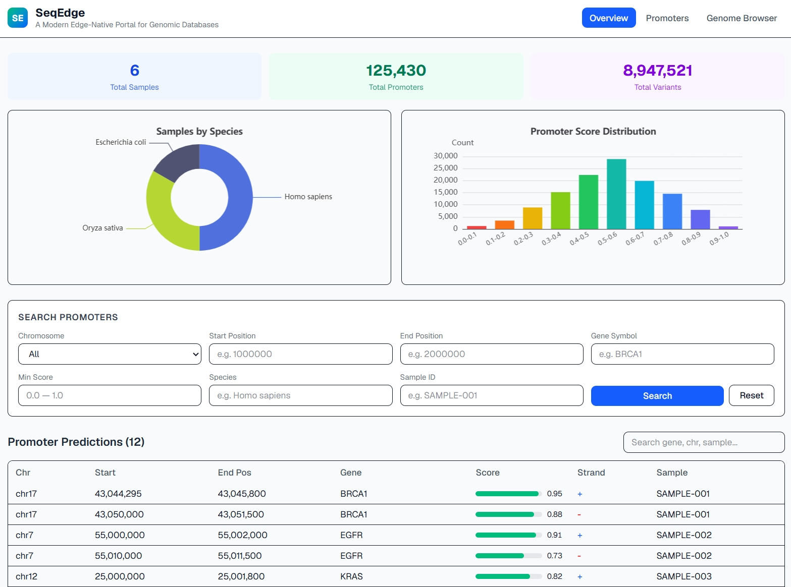
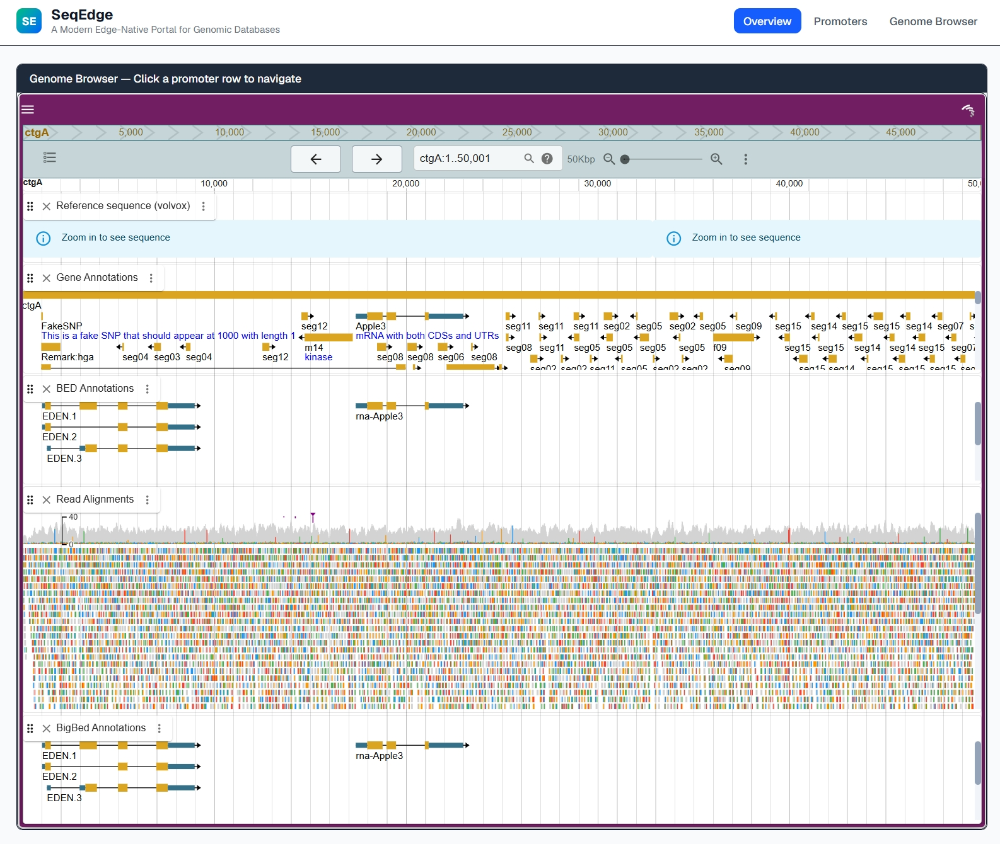

<div align="center"><a name="readme-top"></a>



<br/>



# SeqEdge

**面向边缘架构的可扩展基因组数据库模板**

一个现代化、开源、可快速二次开发的交互式基因组数据库模板。

**🚀 主力部署**: [https://seq-edge.vercel.app](https://seq-edge.vercel.app) | **国内镜像**: [https://seqedge.pages.dev](https://seqedge.pages.dev) · [GitHub][github-repo-link]

**English** | **简体中文** | [问题反馈][github-issues-link]

> ?? **详细搭建指南**：[https://www.cnblogs.com/Helloxiaolaodi/p/21776373](https://www.cnblogs.com/Helloxiaolaodi/p/21776373) — 从 fork 到部署的完整教程。

技术栈：Next.js | Supabase | Cloudflare R2 | JBrowse 2 | TanStack Table | ECharts

<!-- SHIELD GROUP -->

[![][github-license-shield]][github-license-link]
[![][github-stars-shield]][github-stars-link]
[![][github-forks-shield]][github-forks-link]
[![][github-issues-shield]][github-issues-link]<br/>
[![][nextjs-shield]][nextjs-link]
[![][supabase-shield]][supabase-link]
[![][vercel-shield]][vercel-link]

**分享 SeqEdge 仓库**

[![][share-x-shield]][share-x-link]
[![][share-reddit-shield]][share-reddit-link]
[![][share-weibo-shield]][share-weibo-link]

<sup>开源基因组数据库模板</sup>

</div>

<details>
<summary><kbd>目录</kbd></summary>

#### TOC

- [SeqEdge](#seqedge)
  - [什么是 SeqEdge？](#什么是-seqedge)
  - [架构](#架构)
  - [快速开始](#快速开始)
  - [自定义配置](#自定义配置)
  - [功能模块](#功能模块)
  - [成本估算](#成本估算)
  - [云服务配置](#云服务配置)
  - [技术栈](#技术栈)
  - [致谢](#致谢)
  - [许可证](#许可证)

<br/>

</details>

## 什么是 SeqEdge？

SeqEdge 是一个用于构建交互式基因组数据库网站的 **模板仓库**。它适合展示预测启动子、全基因组注释以及其他坐标型组学数据，并采用完全无服务器、面向边缘网络的架构，可运行在主流云平台的免费层上。

如果你已经有启动子预测结果、基因注释文件，或者任何基于染色体坐标的基因组数据，可以直接 fork 这个仓库，替换配置与数据源，在较短时间内搭建自己的数据库网站。

`SeqEdge` 这个名字来自 **Seq**（测序 / 序列）与 **Edge**（边缘计算 / 边缘网络）的组合，表达的是基因组数据和现代云原生基础设施的结合。

> [!IMPORTANT]
>
> SeqEdge 的目标是让实验室、课题组或数据库项目可以快速 fork 并改造成自己的站点。如果这个仓库对你有帮助，建议点一个 star 以便跟踪后续更新。

<div align="right">

[![][back-to-top]](#readme-top)

</div>

## 架构

```text
+-----------------------------------------------------------+
|  Vercel（主力）             Cloudflare Pages（备用镜像）    |
|  全球 CDN                    面向国内用户的边缘网络        |
|  Next.js 前端 + API 路由    Next.js 前端 + API 路由      |
|   +-----------+             +-----------+                 |
|   | ECharts   |             | ECharts   |                 |
|   | TanStack  |             | TanStack  |                 |
|   | Browser   |             | Browser   |                 |
|   +-----------+             +-----------+                 |
+------------------------+----------------------+-----------+
                         |                      |
                         v                      v
          +------------------------+   +------------------------+
          | Supabase (免费层)      |   | Cloudflare R2 (免费层) |
          | PostgreSQL 元数据库    |   | 对象存储               |
          | - genome_samples       |   | - FASTA 文件           |
          | - promoters            |   | - BED / BigBed 轨道    |
          | - variant_index        |   | - BigWig 信号轨道      |
          +------------------------+   | - VCF 及索引文件       |
                                       +------------------------+
```

**部署模型**

- **Vercel**（主力）— 通过全球 CDN 服务主要流量。
- **Cloudflare Pages**（备用镜像）— 通过 Cloudflare 边缘网络为中国大陆用户提供备用访问。

**数据流**

1. 用户通过 Vercel 全球 CDN（国内用户可通过 Cloudflare Pages）打开网站。
2. 前端从 Supabase 查询元数据，例如坐标、得分、基因名称等。
3. 用户点击某个启动子或基因组区间时，Genome Browser 再按需从 R2 拉取所需字节范围的数据。
4. 大体积基因组文件始终存放在对象存储中，而不是塞进关系数据库。

<div align="right">

[![][back-to-top]](#readme-top)

</div>

## 快速开始

### 环境准备

- [Node.js](https://nodejs.org/) 18+
- [Git](https://git-scm.com/)
- 一个 [Supabase](https://supabase.com/) 账号
- 一个 [Vercel](https://vercel.com/) 账号
- 一个 [Cloudflare](https://cloudflare.com/) 账号，用于 R2（本地开发阶段可选）

### 第 1 步：Fork 并克隆仓库

```bash
# 先在 GitHub 上 fork 本仓库，然后克隆你的 fork
git clone https://github.com/YOUR_USERNAME/SeqEdge.git
cd SeqEdge
npm install
```

### 第 2 步：配置环境变量

```bash
cp .env.example .env.local
```

编辑 `.env.local`：

```env
NEXT_PUBLIC_SUPABASE_URL=https://your-project.supabase.co
NEXT_PUBLIC_SUPABASE_ANON_KEY=your_anon_key_here
NEXT_PUBLIC_R2_PUBLIC_URL=https://your-r2-bucket.r2.dev
```

### 第 3 步：初始化数据库

1. 打开你的 Supabase 项目后台。
2. 进入 **SQL Editor**。
3. 把 `schema.sql` 的内容复制进去。
4. 点击 **Run**，创建表、索引和示例数据。

### 第 4 步：本地运行

```bash
npm run dev
```

打开 [http://localhost:3000](http://localhost:3000) 查看带示例数据的站点。

### 第 5 步：部署

SeqEdge 支持双平台部署：**Vercel**（主力）和 **Cloudflare Pages**（国内备用镜像）。

**方式 A：Vercel（推荐，主力部署）**

1. 把代码推送到 GitHub。
2. 在 [vercel.com/new](https://vercel.com/new) 导入仓库。
3. 在 Vercel 后台补齐环境变量。
4. 部署并发布网站。

**方式 B：Cloudflare Pages（国内备用镜像）**

1. 本地构建并验证：`npm run build:cf`
2. 在 Cloudflare Pages 后台 → Settings → Build & deployments 中修改：

   | 设置项 | 值 |
   | --- | --- |
   | Framework preset | `None` |
   | Build command | `npm run build:cf` |
   | Build output directory | `.open-next/assets` |

3. 确认三个环境变量都已配置：`NEXT_PUBLIC_SUPABASE_URL`、`NEXT_PUBLIC_SUPABASE_ANON_KEY`、`NEXT_PUBLIC_R2_PUBLIC_URL`。
4. 提交并推送到 GitHub，Cloudflare Pages 会自动触发新部署。

> [!TIP]
>
> 第一次部署建议先保留示例数据，优先确认 Supabase 和 R2 的连接都正常，再切换到正式数据集。

<div align="right">

[![][back-to-top]](#readme-top)

</div>

## 自定义配置

### 必改的核心文件

`src/site-config.ts` 是整个站点配置的中心文件。你可以在这里修改站点名称、配色、默认基因组装配、轨道设置和功能开关。

```typescript
export const SiteConfig = {
  title: 'MyGenomeDB',
  subtitle: 'A Promoter Database',
  colors: {
    primary: '#1E3A8A',
  },
  jbrowse: {
    defaultAssembly: 'hg38',
    storageBaseUrl: process.env.NEXT_PUBLIC_R2_PUBLIC_URL,
  },
  chromosomes: ['chr1', 'chr2'],
  // ...
};
```

### 接入真实数据

1. 将基因组文件上传到 Cloudflare R2，并确保配套索引文件 `.fai`、`.bai`、`.tbi` 一并上传。
2. 将启动子预测结果、样本信息等元数据导入 Supabase。
3. 在 `src/site-config.ts` 中更新物种装配名称和轨道定义。
4. 把 `src/app/page.tsx` 中的示例查询替换为你的真实 Supabase 查询逻辑。

### 数据格式要求

**Supabase `predicted_promoters` 表建议字段**

| 字段 | 类型 | 必填 | 示例 |
| --- | --- | --- | --- |
| `sample_id` | `text` | 是 | `SAMPLE-001` |
| `chrom` | `text` | 是 | `chr17` |
| `start` | `integer` | 是 | `43044295` |
| `end_pos` | `integer` | 是 | `43045800` |
| `score` | `numeric(0-1)` | 是 | `0.95` |
| `strand` | `text (+/-)` | 是 | `+` |
| `gene_symbol` | `text` | 否 | `BRCA1` |
| `sequence` | `text` | 否 | `ATGCGTAC...` |

**Cloudflare R2 文件目录建议**

```text
your-bucket/
  genomes/
    hg38.fa
    hg38.fa.fai
    hg38.fa.dict
  tracks/
    predicted_promoters.bed.gz
    predicted_promoters.bed.gz.tbi
    rnaseq_coverage.bw
    chipseq_peaks.bed.gz
    chipseq_peaks.bed.gz.tbi
```

<div align="right">

[![][back-to-top]](#readme-top)

</div>

## 功能模块

整个代码库按模块组织，各功能基本可以独立理解和替换。

| 模块 | 文件 | 说明 |
| --- | --- | --- |
| 统计面板 | `src/components/stats-chart.tsx` | 物种分布饼图与得分分布柱状图 |
| 搜索筛选 | `src/components/search-filters.tsx` | 多条件启动子检索 |
| 数据表格 | `src/components/promoter-table.tsx` | 可排序、可筛选、可分页的表格 |
| 启动子详情 | `src/components/promoter-detail.tsx` | 包含坐标、得分、序列与导出能力的详情弹窗 |
| 基因组浏览器 | `src/components/genome-browser.tsx` | 可接入 JBrowse 2 的基因组浏览界面 |

如果想关闭某个功能，可在 `src/site-config.ts` 里调整：

```typescript
features: {
  enableGenomeBrowser: false,
  enableStatsCharts: true,
  enableVariantSearch: false,
}
```

<div align="right">

[![][back-to-top]](#readme-top)

</div>

## 成本估算

| 服务 | 免费层 | 付费层 |
| --- | --- | --- |
| Vercel（主力） | 每月 100 GB 带宽 | Pro $20 / 月 |
| Cloudflare Pages（备用镜像） | 每月 500 次构建，无限带宽 | $5 / 月 更高限额 |
| Supabase | 500 MB 数据库，2 GB 带宽 | Pro $25 / 月 |
| Cloudflare R2 | 10 GB 存储，出口免费 | $0.015 / GB / 月 |
| 域名 | `.vercel.app` / `.pages.dev` 免费 | 自定义域名约 $10 / 年 |

> [!NOTE]
>
> 对于论文配套数据库或课题展示站点，开发和评审阶段通常可以完全跑在免费层上。正式公开后，只要把大文件放在 R2、元数据保留在 Supabase，整体成本仍然比较低。

<div align="right">

[![][back-to-top]](#readme-top)

</div>

---

## 云服务配置

这一部分说明 SeqEdge 依赖的三个核心云服务如何注册与配置。它们的免费层通常足够支持开发、演示和早期发布。

### A. Supabase（PostgreSQL 数据库）

Supabase 用于存储启动子元数据、样本信息以及可选的变异索引。

**第 1 步：创建账号**

1. 打开 [supabase.com](https://supabase.com/)。
2. 点击 **Start your project**，使用 GitHub 或邮箱注册。

**第 2 步：创建项目**

1. 点击 **New Project**。
2. 填写：
   - **Name**：`seqedge-db`
   - **Database Password**：设置并妥善保存数据库密码
   - **Region**：选择靠近目标用户的区域
3. 等待项目初始化完成。

**第 3 步：获取凭证**

1. 进入 **Settings -> API**。
2. 复制：
   - **Project URL**
   - **anon public key**
3. 写入 `.env.local`：

```env
NEXT_PUBLIC_SUPABASE_URL=https://abcdefgh.supabase.co
NEXT_PUBLIC_SUPABASE_ANON_KEY=eyJhbGciOi...
```

**第 4 步：创建表结构**

1. 打开 **SQL Editor**。
2. 新建查询。
3. 粘贴 `schema.sql` 内容。
4. 运行脚本。
5. 在 **Table Editor** 中确认表和示例数据已经创建成功。

**第 5 步：导入真实数据**

小规模数据可以直接在后台手动插入。

大规模数据更适合用 Python 导入：

```python
import pandas as pd
from supabase import create_client

url = "https://abcdefgh.supabase.co"
key = "eyJhbGciOi..."
supabase = create_client(url, key)

df = pd.read_csv("your_promoters.csv")
records = df.to_dict("records")

for i in range(0, len(records), 500):
    batch = records[i:i + 500]
    supabase.table("predicted_promoters").insert(batch).execute()
    print(f"Inserted {min(i + 500, len(records))}/{len(records)}")
```

> [!NOTE]
>
> 免费层限制包括：500 MB 数据库存储、每月 2 GB 带宽，以及长时间不活跃后的自动休眠。

<div align="right">

[![][back-to-top]](#readme-top)

</div>

### B. Cloudflare R2（基因组文件存储）

R2 用于保存 FASTA、BED、BigWig、BAM 等大文件，以及对应索引文件。Genome Browser 和 JBrowse 相关能力依赖这些文件支持按字节范围读取。

**第 1 步：创建账号**

1. 打开 [cloudflare.com](https://cloudflare.com/) 并注册。
2. 即使不把域名 DNS 托管到 Cloudflare，也可以单独使用 R2。

**第 2 步：创建桶**

1. 打开 **R2 Object Storage**。
2. 点击 **Create bucket**。
3. 使用全局唯一的桶名，例如 `seqedge-genomic-data`。
4. 选择合适的区域提示。

**第 3 步：开启公共访问**

1. 打开桶设置。
2. 为开发环境启用 `r2.dev` 公共访问地址。
3. 将地址写入 `.env.local`：

```env
NEXT_PUBLIC_R2_PUBLIC_URL=https://pub-xxxxxxxxx.r2.dev
```

**第 4 步：配置 CORS**

可参考以下策略：

```json
[
  {
    "AllowedOrigins": [
      "https://your-deployment.vercel.app",
      "http://localhost:3000"
    ],
    "AllowedMethods": ["GET", "HEAD"],
    "AllowedHeaders": ["*"],
    "MaxAgeSeconds": 86400
  }
]
```

**第 5 步：上传基因组文件**

少量测试文件可以直接用 Cloudflare 后台上传。

大文件更适合使用 `rclone`：

```bash
rclone config
rclone copy ./local-genomes/ r2:seqedge-genomic-data/test-data/ --progress --transfers 4
rclone copy ./local-tracks/ r2:seqedge-genomic-data/test-data/ --progress --transfers 4
```

**建议的 R2 目录结构**

```text
seqedge-genomic-data/
  test-data/
    volvox.fa
    volvox.fa.fai
    reference.fa
    reference.fa.fai
    volvox-bed12.bed.gz
    volvox-bed12.bed.gz.tbi
    volvox-sorted.bam
    volvox-sorted.bam.bai
    volvox.gff3
    volvox.bb
```

> [!WARNING]
>
> 所有需要索引的文件，例如 `BED.gz`、`BAM`、`VCF`，都必须和对应索引文件放在同一目录下，否则范围请求会失败。

> [!NOTE]
>
> R2 免费层最有价值的一点是出口流量免费。这也是 SeqEdge 选择它来承载公开基因组数据文件的核心原因之一。

<div align="right">

[![][back-to-top]](#readme-top)

</div>

### C. Vercel（主力前端部署）

Vercel 负责托管 Next.js 前端，并从 GitHub 自动触发预览和正式部署。

**第 1 步：创建账号**

1. 打开 [vercel.com](https://vercel.com/) 并使用 GitHub 注册。

**第 2 步：导入仓库**

1. 点击 **Add New -> Project**。
2. 选择你的 SeqEdge fork。
3. 保持 **Next.js** 预设不变。
4. 点击部署。

**第 3 步：添加环境变量**

在 **Settings -> Environment Variables** 中添加：

| 变量名 | 示例 | 来源 |
| --- | --- | --- |
| `NEXT_PUBLIC_SUPABASE_URL` | `https://abcdefgh.supabase.co` | Supabase API 设置 |
| `NEXT_PUBLIC_SUPABASE_ANON_KEY` | `eyJhbGciOi...` | Supabase API 设置 |
| `NEXT_PUBLIC_R2_PUBLIC_URL` | `https://pub-xxxxxxxxx.r2.dev` | Cloudflare R2 桶设置 |

并勾选 **Production**、**Preview**、**Development** 三个环境。

<details>
<summary><kbd>如何找到 R2 公网地址</kbd></summary>

1. 打开 Cloudflare 控制台。
2. 进入 **R2 Object Storage** 并选择你的桶。
3. 打开 **Settings**。
4. 找到 **Public Development URL**。
5. 将该地址填入 `NEXT_PUBLIC_R2_PUBLIC_URL`，注意不要在末尾加 `/`。

</details>

<details>
<summary><kbd>修改环境变量后如何重新部署</kbd></summary>

1. 打开你的 Vercel 项目。
2. 进入 **Deployments** 标签。
3. 找到最近一次部署。
4. 打开右侧菜单并点击 **Redeploy**。
5. 等待重新构建完成。

</details>

**第 4 步：绑定自定义域名（可选）**

1. 打开 **Settings -> Domains**。
2. 添加域名，例如 `seqedge.yourlab.org`。
3. 如果域名 DNS 在 Cloudflare，按提示添加推荐的 CNAME 记录。
4. 等待 Vercel 自动签发 SSL 证书。

> [!NOTE]
>
> Vercel 免费层通常已足够支持项目首页、论文配套展示站和小规模公共数据库入口。

<div align="right">

[![][back-to-top]](#readme-top)

</div>

### D. Cloudflare Pages（国内备用镜像部署）

SeqEdge 可通过 `opennextjs-cloudflare` 部署到 Cloudflare 全球边缘网络。此镜像专为 Vercel 访问受限的中国大陆用户设计。

> 所有 API 路由（`/api/stats`、`/api/promoters`、`/api/variants`）和动态路由（`/promoter/[id]`）均已被 OpenNext 适配器自动识别为 server function 模式，上传到 Cloudflare 后可以正常工作。

**第 1 步：本地构建验证**

```bash
npm run build:cf
```

构建产物将输出到 `.open-next/assets`。

**第 2 步：配置 Cloudflare Pages**

在 Cloudflare Pages 项目后台 → Settings → Build & deployments 处修改：

| 设置项 | 值（修正后） |
| --- | --- |
| Framework preset | `None` |
| Build command | `npm run build:cf` |
| Build output directory | `.open-next/assets` |

> **重要**：确认 Settings → Environment variables 中三个变量都已配置：
> - `NEXT_PUBLIC_SUPABASE_URL`
> - `NEXT_PUBLIC_SUPABASE_ANON_KEY`
> - `NEXT_PUBLIC_R2_PUBLIC_URL`

**第 3 步：提交并推送**

将本地 SeqEdge 目录中的修改推送到 GitHub。Cloudflare Pages 会自动触发一次新部署。构建日志应显示先运行 `next build`，再执行 `opennextjs-cloudflare build`，最终输出到 `.open-next/assets`。

**故障排查：构建失败提示 `supabaseUrl is required`**

此错误说明 Cloudflare Pages 后台缺少三个 `NEXT_PUBLIC_` 环境变量。Next.js 在构建时需要这些变量来生成静态页面。

| 环境变量 | 用途 |
| --- | --- |
| `NEXT_PUBLIC_SUPABASE_URL` | Supabase 项目地址 |
| `NEXT_PUBLIC_SUPABASE_ANON_KEY` | Supabase 匿名密钥 |
| `NEXT_PUBLIC_R2_PUBLIC_URL` | Cloudflare R2 文件地址 |

修复步骤：

1. 进入 Cloudflare Dashboard → Pages → SeqEdge 项目 → Settings → Environment variables
2. 添加上述三个变量，值与本地 `.env.local` 中的一致
3. 同时勾选 **Production** 和 **Preview** 环境
4. 保存后重新触发部署

**Cloudflare 兼容性相关文件：**

| 文件 | 修改说明 |
| --- | --- |
| `.gitignore` | 新增 `.open-next/` 和 `.wrangler/` |
| `package.json` | 替换为 OpenNext 脚本和固定版本依赖 |
| `package-lock.json` | 重新安装后的锁定文件 |
| `next.config.ts` | 清理了空注释 |
| `wrangler.toml` | 新增 Cloudflare 兼容配置 |
| `open-next.config.ts` | 新增 OpenNext 完整配置 |

<div align="right">

[![][back-to-top]](#readme-top)

</div>

## 技术栈

| 分类 | 技术 | 说明 |
| --- | --- | --- |
| 框架 | [Next.js][nextjs-link] | React 19 与 App Router |
| 数据库 | [Supabase][supabase-link] | PostgreSQL 与 REST API |
| 文件存储 | [Cloudflare R2][r2-link] | 兼容 S3、出口免费 |
| 基因组浏览器 | [JBrowse 2][jbrowse-link] | 可嵌入的基因组浏览流程 |
| 数据表格 | [TanStack Table][tanstack-link] | 适合大表格的排序、筛选和展示 |
| 图表 | [Apache ECharts][echarts-link] | 交互式统计可视化 |
| 样式系统 | [Tailwind CSS][tailwind-link] | 工具类 CSS |
| 主力部署 | [Vercel][vercel-link] | 全球 CDN 与 Git 驱动部署 |
| 备用镜像 | [Cloudflare Pages](https://pages.cloudflare.com/) | 面向国内的边缘网络 |

<div align="right">

[![][back-to-top]](#readme-top)

</div>

## 致谢

SeqEdge 依赖一组非常成熟的开源项目，才使得研究型基因组数据库的快速搭建变得可行。

| 项目 | 作用 |
| --- | --- |
| [Next.js](https://nextjs.org/) | 前端框架与应用运行时 |
| [Supabase](https://supabase.com/) | 托管 PostgreSQL 与 API 层 |
| [JBrowse 2](https://jbrowse.org/jb2/) | 交互式基因组浏览器基础 |
| [Cloudflare R2](https://www.cloudflare.com/products/r2/) | 大型基因组文件存储层 |
| [Vercel](https://vercel.com/) | 部署与边缘分发 |
| [TanStack Table](https://tanstack.com/table) | 启动子与位点表格能力 |
| [Apache ECharts](https://echarts.apache.org/) | 统计图表渲染 |
| [Tailwind CSS](https://tailwindcss.com/) | 一致性的界面样式基础 |

SeqEdge 在产品形态上也参考了 [EPD](https://epd.epfl.ch/)、[DBTSS](https://dbtss.hgc.jp/) 和 [RegulonDB](https://regulondb.ccg.unam.mx/) 等经典数据库，并用现代云原生方式重新组织实现。

<div align="right">

[![][back-to-top]](#readme-top)

</div>

---

## 许可证

MIT - 可自由用于学术和商业项目。

SeqEdge 项目地址：[github.com/Helloxiaolaodi/SeqEdge][github-repo-link]

<!-- LINK GROUP -->

[back-to-top]: https://img.shields.io/badge/-BACK_TO_TOP-151515?style=flat-square
[echarts-link]: https://echarts.apache.org/
[github-forks-link]: https://github.com/Helloxiaolaodi/SeqEdge/network/members
[github-forks-shield]: https://img.shields.io/github/forks/Helloxiaolaodi/SeqEdge?color=8ae8ff&labelColor=black&style=flat-square
[github-issues-link]: https://github.com/Helloxiaolaodi/SeqEdge/issues
[github-issues-shield]: https://img.shields.io/github/issues/Helloxiaolaodi/SeqEdge?color=ff80eb&labelColor=black&style=flat-square
[github-license-link]: https://github.com/Helloxiaolaodi/SeqEdge/blob/main/LICENSE
[github-license-shield]: https://img.shields.io/badge/license-MIT-white?labelColor=black&style=flat-square
[github-repo-link]: https://github.com/Helloxiaolaodi/SeqEdge
[github-stars-link]: https://github.com/Helloxiaolaodi/SeqEdge/stargazers
[github-stars-shield]: https://img.shields.io/github/stars/Helloxiaolaodi/SeqEdge?color=ffcb47&labelColor=black&style=flat-square
[image-banner]: ./public/seqedge-banner.svg
[jbrowse-link]: https://jbrowse.org/jb2/
[nextjs-link]: https://nextjs.org/
[nextjs-shield]: https://img.shields.io/badge/Next.js-16-black?logo=next.js&logoColor=white&style=flat-square
[r2-link]: https://www.cloudflare.com/products/r2/
[share-reddit-link]: https://www.reddit.com/submit?title=SeqEdge%20-%20Scalable%20Genomics%20at%20the%20Edge&url=https%3A%2F%2Fgithub.com%2FHelloxiaolaodi%2FSeqEdge
[share-reddit-shield]: https://img.shields.io/badge/-share%20on%20reddit-black?labelColor=black&logo=reddit&logoColor=white&style=flat-square
[share-weibo-link]: http://service.weibo.com/share/share.php?sharesource=weibo&title=Check%20this%20GitHub%20repository%20out%20SeqEdge%20-%20A%20modern%2C%20open-source%20template%20for%20building%20genomic%20databases.&url=https%3A%2F%2Fgithub.com%2FHelloxiaolaodi%2FSeqEdge
[share-weibo-shield]: https://img.shields.io/badge/-share%20on%20weibo-black?labelColor=black&logo=sinaweibo&logoColor=white&style=flat-square
[share-x-link]: https://x.com/intent/tweet?text=Check%20out%20SeqEdge%20-%20A%20modern%2C%20open-source%20template%20for%20building%20genomic%20databases.&url=https%3A%2F%2Fgithub.com%2FHelloxiaolaodi%2FSeqEdge
[share-x-shield]: https://img.shields.io/badge/-share%20on%20x-black?labelColor=black&logo=x&logoColor=white&style=flat-square
[supabase-link]: https://supabase.com/
[supabase-shield]: https://img.shields.io/badge/Supabase-3ECF8E?logo=supabase&logoColor=white&labelColor=black&style=flat-square
[tailwind-link]: https://tailwindcss.com/
[tanstack-link]: https://tanstack.com/table
[vercel-link]: https://vercel.com/
[vercel-shield]: https://img.shields.io/badge/Vercel-000000?logo=vercel&logoColor=white&labelColor=black&style=flat-square
